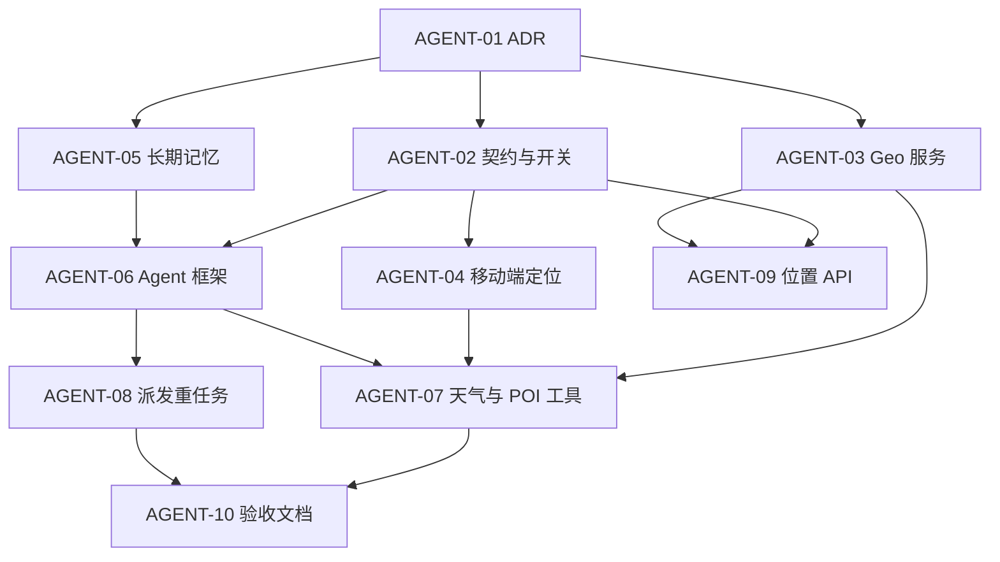

# 真 Agent · Issue 拆分清单

> **来源**：[真 Agent 能力演进计划](.cursor/plans/真_agent_能力演进_df899b55.plan.md)（grill-me + to-issues）  
> **范围决策**：**C 完整 MVP** — 天气 + 地理/POI + 定位 + 长期记忆 + Agent 派发训练/饮食/识图  
> **刻意不含**：向量记忆、SSE 内跑 VLM、饮食计划内容加厚（见文末「并行轨道」）  
> **发布**：本地清单；确认后可 `gh issue create` 同步到 GitHub  
> **实施文档（给各 Agent）**：[`docs/issues/agent/README.md`](./issues/agent/README.md) — 每 Issue 一份详细交接说明

---

## 依赖总览

**建议实施 waves**

| Wave | Issues                         | 可演示结果                                |
| ---- | ------------------------------ | ----------------------------------------- |
| W0   | AGENT-01                       | ✅ ADR 0008 Accepted（2026-06-04）        |
| W1   | AGENT-02, 03, 04, 05（可并行） | 契约、Geo 单测、定位上报、记忆读写        |
| W2   | AGENT-06                       | Agent 骨架 + fitness_snapshot 工具        |
| W3   | AGENT-07, 08, 09               | 天气/健身房问答 + Agent 触发生成计划/识图 |
| W4   | AGENT-10                       | 自动化验收 + 文档                         |

---

## AGENT-01 — ADR 0008：Coach Agent 与工具契约 ✅

| 字段           | 值                                                                                       |
| -------------- | ---------------------------------------------------------------------------------------- |
| **Type**       | HITL                                                                                     |
| **Blocked by** | None                                                                                     |
| **估时**       | 0.5–1 天                                                                                 |
| **状态**       | **已完成** · 2026-06-04                                                                  |
| **详细文档**   | [**AGENT-01.md**](./issues/agent/AGENT-01.md)                                            |
| **产出**       | [`adr/0008-coach-agent-tools-and-memory.md`](./adr/0008-coach-agent-tools-and-memory.md) |

摘要：ADR 0008 Accepted；0007 部分 Superseded；ARCHITECTURE §3、README 已同步。W1（02～05）可并行开工。

---

## AGENT-02 — 共享契约与 Agent Feature Flag

| 字段           | 值                                            |
| -------------- | --------------------------------------------- |
| **Type**       | AFK                                           |
| **Blocked by** | AGENT-01 ✅                                   |
| **估时**       | 1 天                                          |
| **详细文档**   | [**AGENT-02.md**](./issues/agent/AGENT-02.md) |

摘要：shared Zod（Location、ToolName、SSE tool 事件）、`COACH_AGENT_ENABLED` 环境变量；**不改**运行时行为。**✅ 已完成。**

---

## AGENT-03 — 服务端 Geo 基础设施（高德 + Open-Meteo）

| 字段           | 值                                            |
| -------------- | --------------------------------------------- |
| **Type**       | AFK                                           |
| **Blocked by** | AGENT-01, AGENT-02                            |
| **估时**       | 1.5–2 天                                      |
| **详细文档**   | [**AGENT-03.md**](./issues/agent/AGENT-03.md) |

摘要：`infra/geo` Amap + Open-Meteo 客户端、mock 单测；不接入 Coach。

---

## AGENT-04 — 移动端定位模块与 CHAT 上报

| 字段           | 值                                            |
| -------------- | --------------------------------------------- |
| **Type**       | AFK                                           |
| **Blocked by** | AGENT-02                                      |
| **估时**       | 1.5–2 天                                      |
| **详细文档**   | [**AGENT-04.md**](./issues/agent/AGENT-04.md) |

摘要：Android 权限、`features/location`、CHAT 附带 `locationContext`、API 持久化。

---

## AGENT-05 — 长期记忆：UserAgentMemory 读写

| 字段           | 值                                            |
| -------------- | --------------------------------------------- |
| **Type**       | AFK                                           |
| **Blocked by** | AGENT-01, AGENT-02                            |
| **估时**       | 2–3 天                                        |
| **详细文档**   | [**AGENT-05.md**](./issues/agent/AGENT-05.md) |

摘要：Prisma 表、异步抽取 job、prompt 注入；无向量库。

---

## AGENT-06 — Agent 核心：LangGraph ReAct + ToolRegistry 骨架

| 字段           | 值                                            |
| -------------- | --------------------------------------------- |
| **Type**       | AFK                                           |
| **Blocked by** | AGENT-02, AGENT-05                            |
| **估时**       | 3–4 天                                        |
| **详细文档**   | [**AGENT-06.md**](./issues/agent/AGENT-06.md) |

摘要：LangGraph + Registry + Runner + SSE tool 事件；首工具 `get_user_fitness_snapshot`；feature flag 回退。

---

## AGENT-07 — 天气与出差健身房工具（端到端）

| 字段           | 值                                            |
| -------------- | --------------------------------------------- |
| **Type**       | AFK                                           |
| **Blocked by** | AGENT-03, AGENT-04, AGENT-06                  |
| **估时**       | 2–3 天                                        |
| **详细文档**   | [**AGENT-07.md**](./issues/agent/AGENT-07.md) |

摘要：3 个 Geo 工具 + 防幻觉 Prompt + 移动端 tool 状态 UI。

---

## AGENT-08 — Agent 派发重任务（计划 / 识图）

| 字段           | 值                                            |
| -------------- | --------------------------------------------- |
| **Type**       | AFK                                           |
| **Blocked by** | AGENT-06                                      |
| **估时**       | 2 天                                          |
| **详细文档**   | [**AGENT-08.md**](./issues/agent/AGENT-08.md) |

摘要：`enqueue_plan_generate` / `enqueue_meal_vision`；共用现有 Worker 与卡片 UX。

---

## AGENT-09 — 用户最近位置 HTTP API（社区预热）

| 字段           | 值                                            |
| -------------- | --------------------------------------------- |
| **Type**       | AFK                                           |
| **Blocked by** | AGENT-02, AGENT-03                            |
| **估时**       | 1 天                                          |
| **详细文档**   | [**AGENT-09.md**](./issues/agent/AGENT-09.md) |

摘要：`UserLocationSnapshot` + `PUT/GET /users/me/location`；M6 预热。

---

## AGENT-10 — Agent 验收脚本与 M5 文档

| 字段           | 值                                            |
| -------------- | --------------------------------------------- |
| **Type**       | AFK                                           |
| **Blocked by** | AGENT-07, AGENT-08                            |
| **估时**       | 1–2 天                                        |
| **详细文档**   | [**AGENT-10.md**](./issues/agent/AGENT-10.md) |

摘要：`m5-agent-acceptance.ps1`、`HANDOFF-M5.md`、Epic 关闭检查表。

---

## 并行轨道（不在 Agent MVP 内，可选另开 Epic）

用户提到「生成的 plan 不太详细」——与 Agent **正交**，建议 **不要塞进 AGENT-08**，单独排期：

### MEAL-QUALITY-01 — 饮食计划与食物库对齐

| 字段           | 值                                                          |
| -------------- | ----------------------------------------------------------- |
| **Type**       | AFK                                                         |
| **Blocked by** | None（可与 Agent W1 并行）                                  |
| **估时**       | 2–4 天                                                      |
| **详细文档**   | [**MEAL-QUALITY-01.md**](./issues/agent/MEAL-QUALITY-01.md) |

摘要：食物 seed 50–80、`availableFoodNames`、落库 `foodId`；与 Agent Epic 独立。

---

## grill-me 已决议项（记录）

| 问题       | 选择                                       |
| ---------- | ------------------------------------------ |
| 实施节奏   | M4 关闭后再做 Agent                        |
| 地图服务   | 高德                                       |
| MVP 范围   | **C 完整 MVP**（含记忆 + enqueue）         |
| Issue 发布 | **先本地文档**，确认后再 `gh issue create` |

## 下一步

1. 分配任务：将 [`docs/issues/agent/AGENT-XX.md`](./issues/agent/README.md) **全文**粘贴给对应 Agent 会话
2. 若无异议，可对每个 `AGENT-xx` 执行 `gh issue create`（body 链接到详细文档）
3. W0 从 **AGENT-01** 开始（HITL，需人审 ADR）

---

_版本：v2 · 含分 Issue 实施文档 · 2026-06-04_
