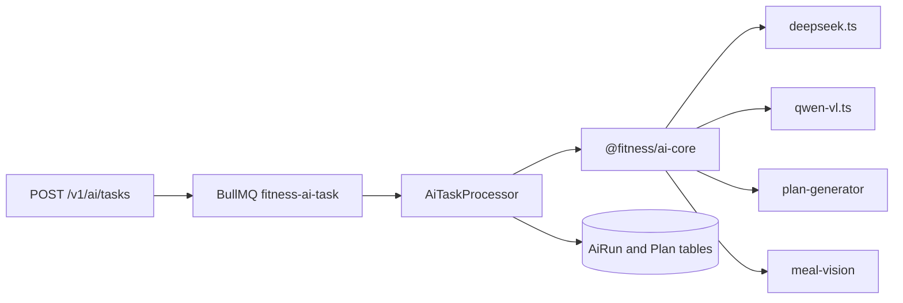

# 交接文档 · M3 阶段（AI 核心 / `packages/ai-core`）

> **M3 已关闭（功能闭环）。当前阶段入口：** [`docs/HANDOFF-M4.md`](./HANDOFF-M4.md)。  
> 本文档保留 M3 范围与验收定义；会话增量见 [`docs/HANDOFF-M3-AGENT.md`](./HANDOFF-M3-AGENT.md)。M2 见 [`HANDOFF-M2.md`](./HANDOFF-M2.md)。

---

## 0. 给下一位 Agent 的「系统提示」——请整段复制新开会话

```
你是接手 Fitness AI Assistant 项目的开发 Agent。M2 已完成，当前进入 M3（AI 核心）。

项目根目录（Windows + PowerShell）：用户本地路径以用户消息为准；仓库为 pnpm + Turborepo monorepo。

硬性约束（不要重新讨论）：
1. 用户环境：Windows、PowerShell；不要用 bash 式命令（mkdir -p、rm -rf、cp）；脚本优先 .ps1 或跨平台 npm 包。
2. 回复语言：简体中文；代码注释可用中文。
3. ARCHITECTURE / PRD / 已有 ADR（0001–0004）中的架构决策已锁定；若发现矛盾，先写 ADR 草稿（0005+）再让用户确认，不要擅自改 PRD/ARCHITECTURE 正文。
4. ADR 0003：HTTP 永远不阻塞等 LLM；AI 在 Worker 内执行；队列名与 HTTP 一致（fitness-ai-task）。
5. 契约：HTTP DTO 与 AI 输出以 packages/shared 的 Zod 为准；类型用 z.infer，禁止手写重复 interface。
6. 包引用：workspace 协议 @fitness/*；apps/api 显式依赖 @prisma/client；Worker 依赖 @fitness/ai-core。
7. mobile：M3 不 init React Native、不装 Expo（bare RN，M4）。
8. Phase 2 表（Post 等）已有于 DB，M3 勿暴露新 HTTP API。
9. Git：用户未明确要求时不要代执行 git commit；提交信息需 Conventional Commits（husky + commitlint）。

M3 目标（README Roadmap + packages/ai-core/README）：
- packages/ai-core：DeepSeek（计划/分析）+ Qwen-VL（meal-vision Chain）+ LangGraph plan-generator。
- 替换 apps/api/src/workers/ai-task.processor.ts 桩：按 taskType 调用 ai-core，完整写 AiRun（tokenIn/Out、costCny、durationMs、outputJson、errorMsg）。
- 环境变量：DEEPSEEK_API_KEY、DEEPSEEK_BASE_URL（可选）、DASHSCOPE_API_KEY（见根 .env.example 注释）。

必读顺序：
docs/HANDOFF-M3.md（本文件）
→ docs/PRD.md（F3 训练计划、F4 饮食计划、§5.3 AI 异步）
→ docs/ARCHITECTURE.md（§3 packages/ai-core、§5 AI 任务链路）
→ docs/adr/0003-modular-monolith-with-worker.md
→ docs/HANDOFF-M2.md §3「明确不做」（防把 M3 工作倒回 M2 或提前做 M4）

M2 已就绪（勿重做）：auth/users/exercises/foods/uploads、POST /v1/ai/tasks + GET 状态、BullMQ、Prisma AiRun 表、三入口 main/worker/schedule。

本地环境：Docker Desktop 须 Running；DATABASE_URL / S3_ENDPOINT / REDIS_URL 建议 127.0.0.1（Windows）；apps/api 通过 load-api-env.ts 加载 apps/api/.env。

开始做事前：pnpm install → pnpm --filter @fitness/shared build → pnpm --filter @fitness/db build → docker compose up → migrate:deploy + seed → 再实现 ai-core 与 Processor 改造。
```

---

## 1. Roadmap 进度

| 阶段   | 状态        | 说明                                                                                                                 |
| ------ | ----------- | -------------------------------------------------------------------------------------------------------------------- |
| M0–M1  | ✅          | PRD、ARCH、monorepo、Prisma+seed、ADR 0001–0004、CI                                                                  |
| **M2** | **✅**      | [`apps/api`](../../apps/api) HTTP MVP + Worker 桩；[`scripts/m2-acceptance.ps1`](../scripts/m2-acceptance.ps1) 19/19 |
| **M3** | **✅**      | ai-core + Worker；见 [`HANDOFF-M3-AGENT.md`](./HANDOFF-M3-AGENT.md)                                                  |
| **M4** | **⬜ 当前** | [`apps/mobile`](../apps/mobile) bare RN                                                                              |
| M5+    | ⬜          | APK CI、Phase 2 等                                                                                                   |

---

## 2. M2 已完成摘要（M3 可依赖，勿重写）

| 能力       | 位置 / 说明                                                                                                                           |
| ---------- | ------------------------------------------------------------------------------------------------------------------------------------- | --------------------- |
| HTTP `/v1` | auth、users、exercises、foods、`uploads/sign                                                                                          | complete`、`ai/tasks` |
| Worker 桩  | [`apps/api/src/workers/ai-task.processor.ts`](../apps/api/src/workers/ai-task.processor.ts) — 300ms sleep → `DONE` + `{ stub: true }` |
| 队列       | `AI_TASK_QUEUE_NAME = 'fitness-ai-task'`；HTTP 与 Worker 共用                                                                         |
| 环境加载   | [`apps/api/src/load-api-env.ts`](../apps/api/src/load-api-env.ts) — 固定 `apps/api/.env`                                              |
| 验收脚本   | [`scripts/m2-acceptance.ps1`](../scripts/m2-acceptance.ps1) — M3 后仍可作为回归（桩行为将变）                                         |
| Swagger    | 已启用；**无 requestBody 表单**（`@Body() unknown` + `parseWith`），见 §3                                                             |

详细模块列表与 Git 状态：[`HANDOFF-M2-AGENT.md`](./HANDOFF-M2-AGENT.md)。

---

## 3. 用户本机实操备忘（会话增量）

| 现象                                               | 处理                                                                              |
| -------------------------------------------------- | --------------------------------------------------------------------------------- |
| `dockerDesktopLinuxEngine` 找不到                  | 先启动 **Docker Desktop**，再 `docker compose -f docker/docker-compose.yml up -d` |
| Swagger Try it out **无输入框**，Execute → **400** | OpenAPI 未生成 body schema；用 PowerShell / curl 或 `m2-acceptance.ps1`           |
| 登录成功但终端**看不到 tokens**                    | `$res \| ConvertTo-Json -Depth 5` 或 `$res.tokens.accessToken`                    |
| Swagger **Authorize** 只有 Value                   | 填 **accessToken**（可试 `Bearer <token>` 或仅 token 字符串）                     |
| AI 任务一直 **QUEUED**                             | 未开 `pnpm --filter api start:worker`，或 Redis 连不上                            |
| MinIO 预签名 PUT **超时**                          | `apps/api/.env` 中 `S3_ENDPOINT=http://127.0.0.1:9000`（勿用 localhost）          |
| `pnpm lint` 报 db `dist/generated` 锁文件          | 先停 API/worker 的 node 进程再跑全仓 lint                                         |

**PowerShell 登录示例**：

```powershell
$body = '{"phone":"13912345678","password":"TestPass1"}'
$res = Invoke-RestMethod -Uri "http://127.0.0.1:3000/v1/auth/login" -Method POST -ContentType "application/json" -Body $body
$access = $res.tokens.accessToken
$headers = @{ Authorization = "Bearer $access" }
```

---

## 4. M3 范围

### 4.1 必须做

对齐 [`docs/ARCHITECTURE.md`](./ARCHITECTURE.md) §3 `packages/ai-core` 与 [`packages/ai-core/README.md`](../packages/ai-core/README.md)：

```
packages/ai-core/src/
├── llm/              deepseek.ts, qwen-vl.ts, factory.ts
├── prompts/
├── chains/meal-vision/
├── graphs/plan-generator/
├── parsers/          Zod 解析 + 重试
└── index.ts
```

| 工作项                 | 说明                                                                                                                                                                     |
| ---------------------- | ------------------------------------------------------------------------------------------------------------------------------------------------------------------------ |
| LLM 客户端             | DeepSeek（OpenAI 兼容）、Qwen-VL（DashScope）；无 Key 时明确错误                                                                                                         |
| `meal-vision` Chain    | 图片 → JSON；输出校验 [`MealVisionResultSchema`](../packages/shared/src/schemas/nutrition.ts)                                                                            |
| `plan-generator` Graph | LangGraph：评估→训练→饮食→校验→retry（可先最小单节点再扩）                                                                                                               |
| Worker 分发            | 按 [`AiTaskType`](../packages/shared/src/enums/ai-task.ts)：`PLAN_GENERATE_WORKOUT`、`PLAN_GENERATE_MEAL`、`MEAL_VISION`（`MESOCYCLE_REVIEW` / `REPORT_ANALYZE` 可后置） |
| `AiRun` 落库           | `RUNNING` → `DONE`/`FAILED`；填 token、cost、duration、`outputJson` / `errorMsg`                                                                                         |
| 依赖                   | `apps/api` → `@fitness/ai-core`；`ai-core` 增加 build/export（比照 shared/db 的 dist 模式若需要）                                                                        |
| 模型常量               | [`LLM_MODELS`](../packages/shared/src/constants/ai-task.ts)（`deepseek-v3.2`、`qwen-vl-max`）                                                                            |



### 4.2 明确不做（M3）

| 不做                                                | 归属                            |
| --------------------------------------------------- | ------------------------------- |
| `apps/mobile` / Expo                                | M4                              |
| mesocycle 复盘 Cron 业务闭环                        | M3+（`schedule.ts` 可保持占位） |
| Swagger 全量 DTO（可选 `@ApiBody` example，非阻塞） | 可选                            |
| seed 扩至 PRD 80 动作 / 300 食物                    | M2+ 可选                        |
| Phase 2 社交/报告 HTTP                              | 禁止                            |
| 真实 APK / android.yml                              | M5                              |

继承 M2「明确不做」见 [`HANDOFF-M2.md`](./HANDOFF-M2.md) §3。

---

## 5. 建议实施顺序（垂直切片）

1. `ai-core`：`llm/*` + `factory`（无 Key 时单元测试/启动失败信息清晰）。
2. `meal-vision` chain + Zod parser（可用公网图或 MinIO 已上传 `objectKey` URL 测）。
3. 改造 `AiTaskProcessor`：先接通 **MEAL_VISION** → 真实 `outputJson`。
4. `plan-generator` LangGraph 最小路径 → **PLAN_GENERATE_WORKOUT** 或 **PLAN_GENERATE_MEAL**。
5. 写 Plan / WorkoutPlanDay / MealPlan 等表（Prisma 已有模型则对接；缺字段先 ADR）。
6. 填满 `AiRun` 计量字段；可选 `scripts/m3-acceptance.ps1`（无 Key 时 skip 并文档说明）。
7. `pnpm lint` / `typecheck` / `test`；更新 README M3 勾选。

---

## 6. M3 验收标准（完成定义）

- [x] `pnpm --filter @fitness/ai-core build` 成功（若采用 dist 导出）
- [x] 配置 Key 后 **MEAL_VISION** 代码路径完整（`items` + `advice` + `nutritionContext`）；E2E 依赖公网可访问图片 — 见 [`HANDOFF-M3-AGENT.md`](./HANDOFF-M3-AGENT.md)
- [x] **PLAN_GENERATE_WORKOUT** → **DONE** + Plan 落库（`planId`）；实现为**单轮 LLM + Zod**，非 LangGraph 库
- [ ] **PLAN_GENERATE_MEAL** E2E（代码已有，验收脚本未强测）
- [x] `AiRun` 记录 `tokenIn` / `tokenOut` / `costCny` / `durationMs`；失败为 **FAILED** + `errorMsg`
- [x] 无 API Key 时行为在 README/HANDOFF 中写清
- [x] `pnpm lint` 通过（typecheck/test 建议 M4 前全仓再跑）
- [x] 重大新决策 → [`docs/adr/0005-m3-ai-context-and-execution.md`](./adr/0005-m3-ai-context-and-execution.md)
- [ ] （可选）`m2-acceptance.ps1` 回归

---

## 7. ADR 与文档索引

| 主题                                | 引用                                                                                          |
| ----------------------------------- | --------------------------------------------------------------------------------------------- |
| Monorepo、`ai-core` 位置            | [`docs/adr/0001-monorepo-layout.md`](./adr/0001-monorepo-layout.md)                           |
| REST + Zod 契约                     | [`docs/adr/0002-rest-zod-contract.md`](./adr/0002-rest-zod-contract.md)                       |
| HTTP / Worker / Cron 三进程         | [`docs/adr/0003-modular-monolith-with-worker.md`](./adr/0003-modular-monolith-with-worker.md) |
| 餐照上传（MEAL_VISION 输入）        | [`docs/adr/0004-presigned-upload.md`](./adr/0004-presigned-upload.md)                         |
| M3 AI 上下文、二阶段餐照、Plan 落库 | [`docs/adr/0005-m3-ai-context-and-execution.md`](./adr/0005-m3-ai-context-and-execution.md)   |
| AI 异步标准链路                     | [`ARCHITECTURE.md`](./ARCHITECTURE.md) §5                                                     |
| `ai-core` 目录树                    | [`ARCHITECTURE.md`](./ARCHITECTURE.md) §3                                                     |
| 产品 F3/F4、AI 规则                 | [`PRD.md`](./PRD.md)                                                                          |
| M2 验收与约束                       | [`HANDOFF-M2.md`](./HANDOFF-M2.md)                                                            |

---

## 8. 关键命令（PowerShell，仓库根）

```powershell
# 环境
copy .env.example .env
copy .env.example packages\db\.env
copy .env.example apps\api\.env
# 在 .env / apps\api\.env 中取消注释并填写：
# DEEPSEEK_API_KEY=...
# DASHSCOPE_API_KEY=...

docker compose -f docker/docker-compose.yml up -d

pnpm --filter @fitness/shared build
pnpm --filter @fitness/db build
pnpm --filter db migrate:deploy
pnpm --filter db seed

pnpm --filter api build

# 终端 1（建议先 worker）
pnpm --filter api start:worker
# 终端 2
pnpm --filter api start:api

# M2 回归（M3 改造后可能需更新脚本）
.\scripts\m2-acceptance.ps1
```

- 健康检查：<http://127.0.0.1:3000/v1/health>
- Swagger：<http://127.0.0.1:3000/swagger>（手动测 body 见 §3）

---

## 9. M2 遗留技术债（M3 可选处理）

- Session `refreshTokenHash` 占位 `'jwt-refresh'`；refresh 靠 JWT `sid` + Session 未撤销。
- 未使用 `nestjs-zod`；Swagger 无 requestBody schema。
- 集成测试仅 `apps/api/test/parse-with.spec.ts`。
- GitHub CI：待 push 后在 Actions 确认。

---

## 10. 推荐 Skills（下一会话）

| 场景                   | Skill                                              |
| ---------------------- | -------------------------------------------------- |
| M3 实现与验收          | 本文 + PRD / ARCHITECTURE                          |
| LLM 输出/解析失败      | `diagnose`（`~/.agents/skills/diagnose/SKILL.md`） |
| 架构 / Prompt 争议     | `grill-with-docs` + 新 ADR                         |
| Chain / Graph 测试优先 | `tdd`                                              |

---

## 11. Git

- M2/M3 代码可能大量**未提交**；**勿提交** `.env`、`apps/api/.env`。
- 用户未明确要求前**不要**代 `git commit`。

---

## 12. 关键文件索引

```
packages/ai-core/src/          # M3 主战场
apps/api/src/workers/ai-task.processor.ts
apps/api/src/modules/ai-tasks/
apps/api/src/worker.ts
packages/shared/src/schemas/nutrition.ts   # MealVisionResultSchema
packages/shared/src/schemas/plan.ts
packages/shared/src/constants/ai-task.ts   # LLM_MODELS
packages/db/prisma/schema.prisma           # AiRun, Plan, ...
scripts/m2-acceptance.ps1
```

---

_文档版本：v1 · 2026-05-19 · M2 关闭，M3 开工入口_

### 修订记录

| 日期       | 说明                                                  |
| ---------- | ----------------------------------------------------- |
| 2026-05-19 | 初版：自 M2 验收交接至 M3；含系统提示词与用户实操备忘 |
