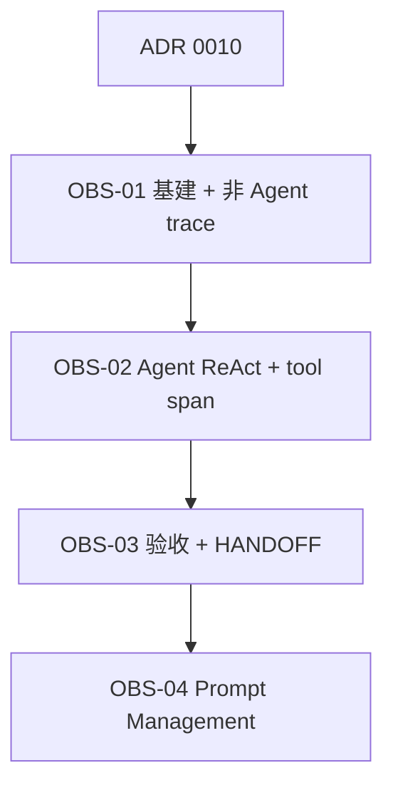

# Coach 聊天观测 · Issue 拆分清单

> **来源**：grill-me 决策（2026-08-10）+ [ADR 0010](./adr/0010-coach-chat-observability-langfuse.md)  
> **范围**：Phase 1 Langfuse trace（`COACH_CHAT`）；Phase 2 Prompt Management  
> **Epic 状态**：⬜ 待实施  
> **实施文档**：[`docs/issues/observability/README.md`](./issues/observability/README.md)

---

## 依赖总览

**建议实施 waves**

| Wave | Issues   | 可演示结果                           | 状态 |
| ---- | -------- | ------------------------------------ | ---- |
| W0   | ADR 0010 | 架构决策 Accepted                    | ✅   |
| W1   | OBS-01   | 非 Agent CHAT 在 Langfuse 可见 trace | ✅   |
| W2   | OBS-02   | Agent 天气/POI 全链路 trace          | ⬜   |
| W3   | OBS-03   | 验收脚本 + HANDOFF                   | ⬜   |
| W4   | OBS-04   | 工具描述 Prompt 版本化（Phase 2）    | ⬜   |

---

## OBS-01 — Langfuse 基础设施 + 非 Agent E2E trace

| 字段           | 值                                            |
| -------------- | --------------------------------------------- |
| **Type**       | AFK                                           |
| **Blocked by** | ADR 0010                                      |
| **文档**       | [OBS-01.md](./issues/observability/OBS-01.md) |

SDK、env、`LANGFUSE_ENABLED`、trace 根、`streamText`/`generateJson` 包装；非 Agent `COACH_CHAT` 端到端可见。

---

## OBS-02 — Agent ReAct + Tool Span

| 字段           | 值                                            |
| -------------- | --------------------------------------------- |
| **Type**       | AFK                                           |
| **Blocked by** | OBS-01                                        |
| **文档**       | [OBS-02.md](./issues/observability/OBS-02.md) |

`chatWithTools` generation + `ToolRegistry` span；Agent 全链路时间线。

---

## OBS-03 — 验收与文档

| 字段           | 值                                            |
| -------------- | --------------------------------------------- |
| **Type**       | AFK                                           |
| **Blocked by** | OBS-02                                        |
| **文档**       | [OBS-03.md](./issues/observability/OBS-03.md) |

`observability-acceptance.ps1`、`AiRun.outputJson.observability`、`HANDOFF-OBSERVABILITY.md`。

---

## OBS-04 — Prompt Management（Phase 2）

| 字段           | 值                                            |
| -------------- | --------------------------------------------- |
| **Type**       | AFK                                           |
| **Blocked by** | OBS-03 + trace 基线                           |
| **文档**       | [OBS-04.md](./issues/observability/OBS-04.md) |

工具描述外置 Langfuse，降错选工具；需积累失败 case 后再开工。

---

## 关键决策速查

- **Langfuse > LangSmith**（现阶段）：包装层埋点、免费档、无意外账单
- **仅 COACH_CHAT**；Worker AI 不 trace
- **默认关闭**：`LANGFUSE_ENABLED=false`
